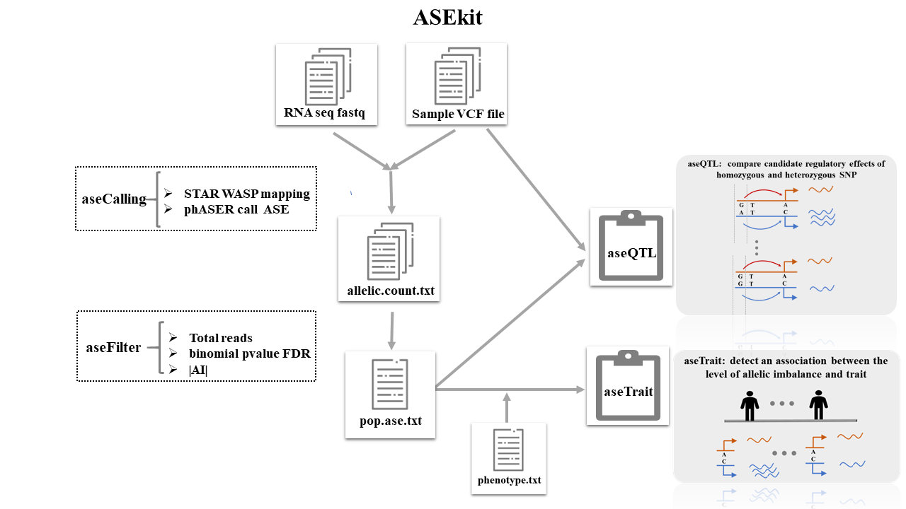

## ASEkit-tutorial
This a simple tutorial displaying how to run ASEkit from genome and transcriptome data.

## Introduction
Allele specific expression(ASE) analysis is a powerful way that can be used to measure the expression of reference and alterative exonic SNP allele in RNA data within a single individuals. The ASE has a siginificant role in tumor initiation and progression,immunity susceptibility[1]. we  provide a convenient tools called ASEkit that you can easily to call ASE and assocaiting it with candidate regultory SNP and trait.

## Requirements
To run ASEkit ,the following software are required:
* [STAR2.7.3.a](https://github.com/alexdobin/STAR/archive/2.7.3a.zip)  
* samtools
* bgzip

R package:
* [EAGLE](https://github.com/davidaknowles/eagle)
* getopt
* parallel
* devtools
Note: please using STAR that version is larger than 2.6.0 because low version STAR have not integrated WASP module.
     R package can be download automatically when you run aseTrait script.
## Installation

ASEkit have been packaged and released on PyPI. You can install this python package by pip.pip install 
```
pip install ASEkit
```

## Running ASEkit


We have prepared a covenient test data in package and example script that can be run directly.
You can run following commond to get the test data fielpath.
```
ASEkit test
```

#### ASEkit Function
##### aseCalling: 
**Call ASE site from RNAseq and vcf file.** RNA reads mapping with allelic mapping bias correction using STAR[2] WASP module[3] in two-pass mode. SNP-level allelic count file is generated using phASER v.3.22.0[4] that have been intergated into this package.


```
ASEkit Calling \
        --sample ./sample.info.txt \
        --rnaseq ./RNA_test_data \
        --vcf ./vcf_test_data \
        --index ~/STAR.ref.index
        --process 4 \
        --outdir ./aseCalling.out
```
```
--sample: sample information file including matching RNAid and DNAid
--rnaseq: directory that store all RNA fastq files
--vcf: directory that store every sample vcf files
--index: reference genome index produced by STAR
--process: Number of parallel processes
--outdir: output directory
##optional：
--STAR: STAR software filepath. If you con not install STAR successfully, specify the software filepath.
```
#### aseFilter:
**Filter sample allelic expression file.** You can get there files: population.ase.txt, population.ase.AI.txt ase.site.merge.txt, meaning allelic imblance, AI value of population level file and exonic SNP sites merge file.
```
ASEkit Filter --rawdir ./example.data/ \
   --totalreads 10 --fdr 0.05 --AIvalue 0.2 \
        --sample sample.info.txt
        --outdir ./out
```

```
--rawdir: result directory produced by aseCalling; aseFilter can find result file automatically
--totalreads : the total RNA reads cutoff of exonic variants, default 10
--fdr: multiple testing binomial pvalue by BH, default 0.05
--AIvalue: allelic imbalance value (|(ref/(ref+alt))-0.5|)
--sample: sample information file including matching RNAid and DNAid
--outdir: output directory
```
#### aseQTL : 

**Detect aseQTL sit.** Find whether allelic imbalance value at the exonic locus of individuals that heterozygous at the candidate regulatory is siginificantly higher than homozygous individuals.
```
ASEkit aseQTL --ase population.ase.test.txt \
        --vcf vcf_filepath.txt \
        --hetNumber 8 \
        --cisRegion 100000 \
        --process 2 \
        --outdir ./ASE.res
 ```
 ```
 --ase: population ase exonic SNP file produced by aseFilter. Sites will be included if one site is a significant ASE site in at least one person.   
--vcf: vcf file path splited by chromosome
--hetNumber: minimum heterozygous exonic locus number to run aseQTL, default 8
--cisRegion: SNP within this distance are considered candidate regultory SNP,default + 100kb
--process: number of parallel processes, default 3
--outdir: output directory
```
 #### aseTrait
**Detect an association between the level of allelic imblance at an exonic SNP and trait.** The statistical model is a binomial Generalized Linear mixed model run by EAGLE[5].
```
ASEkit aseTrait --ase population.ase.test.txt \
        --pheno  pheno.txt \
        --outdir ./out
 ```
```
--ase: population ase exonic SNP file produced by aseFilter
--pheno: phenotype information file
--outdir: output directory
```
#### Reference:
**1.** Przytycki PF, Singh M. Differential Allele-Specific Expression Uncovers Breast Cancer Genes     Dysregulated by Cis Noncoding Mutations. Cell Syst. 2020 Feb 26;10(2):193-203.e4. doi: 10.1016/j.cels.2020.01.002. Epub 2020 Feb 19. PMID: 32078798; PMCID: PMC7457951.Dobin A, Davis CA, Schlesinger F, et al. 
**2.** STAR: ultrafast universal RNA-seq aligner. Bioinformatics. 2013;29(1):15-21. doi:10.1093/bioinformatics/bts635van de Geijn B, McVicker G, Gilad Y, Pritchard JK. 
**3.** WASP: allele-specific software for robust molecular quantitative trait locus discovery. Nat Methods. 2015;12(11):1061-1063. doi:10.1038/nmeth.3582Castel, S., Mohammadi, P., Chung, W. et al. 
**4.** Rare variant phasing and haplotypic expression from RNA sequencing with phASER. Nat Commun 7, 12817 (2016). https://doi.org/10.1038/ncomms12817Knowles DA, Davis JR, Edgington H, et al. 
**5.** Allele-specific expression reveals interactions between genetic variation and environment. Nat Methods. 2017;14(7):699-702. doi:10.1038/nmeth.4298